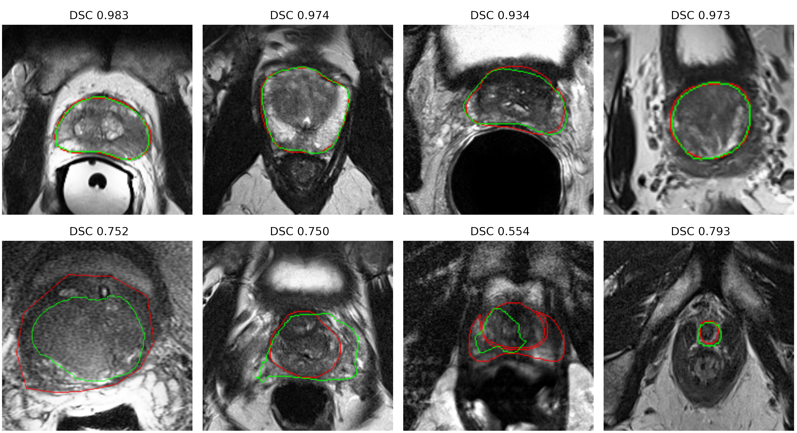

# Automatic Prostate segmentation from MR images
This provides some deep Learning code for training a deep learning model for segmentation from Magnetic Resonance(MR) Images. There is also a pyqt software avaialble to allow users to explore the use of the deep learning model that was trained as part of this project. More details on the model can be found at [here](https://arxiv.org/abs/2011.07795)


## Dependencies
Before running the python software, you need install its dependecies, which relies on Pytorch, FastAi, and PyDicom.You can install the dependences from the command line using the following command: 

```
pip install -r requirements.txt
```

